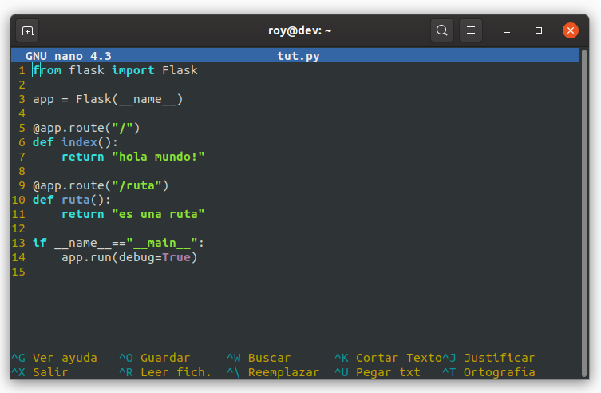

# Configuración archivo .nanorc



Configuración de mi archvo `/home/usuario/.nanorc`:

```bash
set linenumbers         # Habilita el numeros de las líneas
set autoindent          # Habilita la indentación
set tabsize 4           # El tabulador se compone de 4 espacios
set numbercolor cyan
set titlecolor brightwhite,blue
set numbercolor yellow
set keycolor cyan
set functioncolor yellow
set statuscolor brightwhite,blue
```
